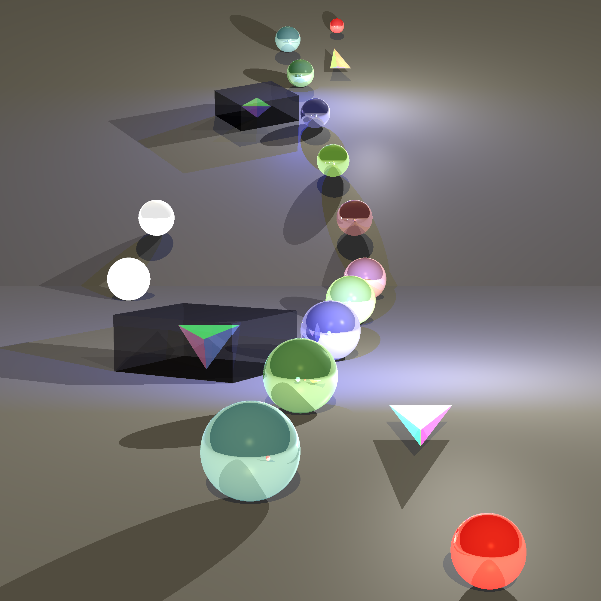

# 🌌 RayTracer Engine – Realistic Rendering in Java (ISE5785)

Welcome to our advanced ray tracing engine built in Java as part of the ISE5785 course.

Designed for physically-accurate and visually stunning rendering, this engine supports a variety of modern effects including Depth of Field, Anti-Aliasing, and Adaptive Sampling – all built from scratch.

---

## 🔭 Motivation

Ray tracing simulates how light travels through space and interacts with surfaces. We developed this project to explore:

- The visual benefits of **adaptive sampling** vs. brute-force methods  
- The combination of **photorealistic effects** like DOF and AA in a clean Java architecture  
- The challenge and reward of creating a full rendering engine from the ground up  

> Inspired by engines like Blender, Pixar’s RenderMan, and modern GPU pipelines.

---

## ✨ Features

- ✅ **Jittered Sampling** – Smoothed randomness for realism  
- ✅ **Depth of Field (DOF)** – Simulate focus blur using aperture-based ray cones  
- ✅ **Anti-Aliasing (AA)** – Smooth jagged edges with smart supersampling
- ✅ **Multithreaded Rendering** – Faster rendering using parallel ray tracing on multiple cores
- ✅ **Adaptive Super Sampling** – Faster rendering with fewer rays using local color variance  
- ✅ **Modular Design** – Clear separation of camera, scene, renderer, lighting  
- ✅ **Physics-Based Rendering** – Realistic shading with material-aware ray tracing

---

## 📸 Visual Comparison

| No Effects | Depth of Field Only |
|------------|---------------------|
|  |  |

| Anti-Aliasing Only | DOF + AA (Final Render) |
|--------------------|---------------|
|  |          |

---

## 🧱 Architecture Overview

```
src/
├── geometries/       # Sphere, Plane, Polygon, etc.
├── lighting/         # Light sources and illumination models
├── primitives/       # Points, Vectors, Rays, Colors, Bounding Boxes
├── renderer/         # Core rendering logic, camera, sampling system
├── scene/            # Scene description, JSON parsing, material setup
└── tests/            # Test scenes and render validation
```

Key component:  
🧠 **BlackBoard.java** – Unified adaptive sampling logic used by AA, DOF, and more.

---

## 🔍 Adaptive Sampling System

We implemented **recursive adaptive supersampling** for performance and quality.

It dynamically adjusts the number of rays based on color variance:

- Areas with **flat color** use fewer rays  
- Edges and fine details use **more rays automatically**

Used in both:
- 🎯 Anti-Aliasing (AA)
- 🔭 Depth of Field (DOF)

---

## 🛠️ How to Run

```bash
# Clone the repository
git clone https://github.com/YOUR_USERNAME/YOUR_PROJECT_NAME.git
cd YOUR_PROJECT_NAME

# Compile (adjust to your structure)
javac -d bin src/**/*.java

# Run main
java -cp bin renderer.Main
```

---

## 👨‍💻 Authors

- [Shimon Khakshour](https://github.com/shimon2005)
- [Asher Abensour](https://github.com/asher603)
---
